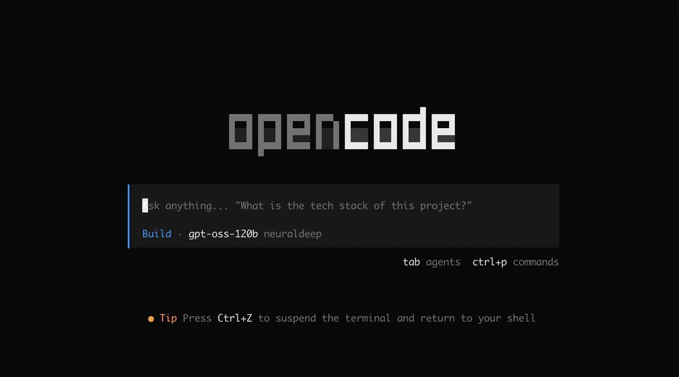
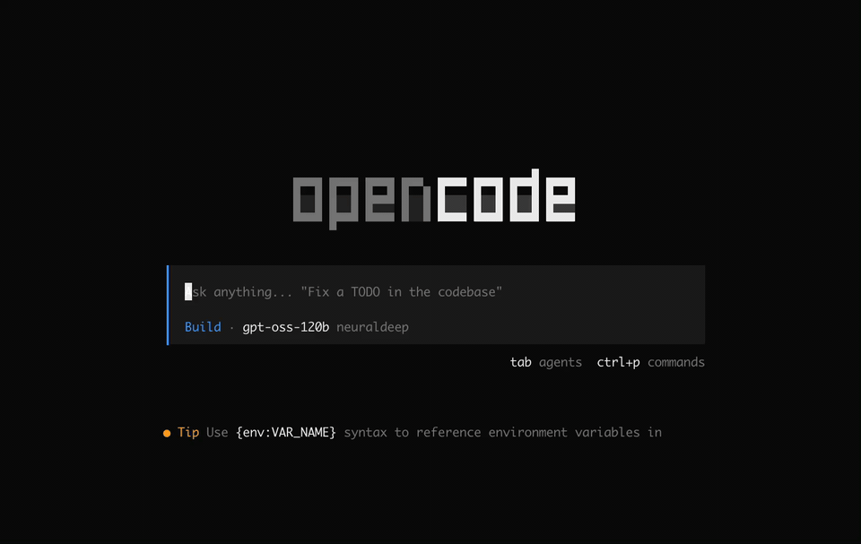

# Opencode policy

OpenCode security plugin with:
- [282 unsafe tool patterns](./src/policies/unsafe-tool-patterns.json)
- [27 prompt injection patterns](./src/policies/prompt-injection-patterns.json)

You can review the full rule sets there and add or remove patterns to fit your workspace.


Unsafe tool patterns


Prompt injection patterns

Use it when you want stronger workspace safety out of the box: it helps prevent secret exposure, exfiltration, unsafe shell execution, reverse shells, denial-of-service commands, cross-workspace access, and common instruction-override attacks. Matching events are logged to `.opencode/opencode-policy.log` for review.

## Simple install

```bash
opencode plugin opencode-policy@latest --global
```

## Install from npm

Install the package:

```bash
npm install opencode-policy
```

Then add it to one of these OpenCode config files:

- `~/.config/opencode/opencode.json` for your user
- `opencode.json` in your project root for one project

```json
{
  "$schema": "https://opencode.ai/config.json",
  "plugin": ["opencode-policy"]
}
```

## License

[MIT](./LICENSE)

## Thanks

Pattern research and source material were adapted in part from [`vakovalskii/topsha`](https://github.com/vakovalskii/topsha)
